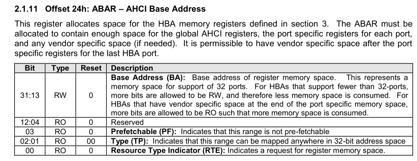

# HBA 初始化流程

>- 通过 HBA 的 PCI 配置空间读取 ABAR 寄存器数据，读出的值为 HBA 寄存器空间在内存空间中的物理地址。然后将 0xffff_ffff 写入 ABAR，再将值读出，就可以得到 HBA 所需的空间大小(参考章节 PCI_SPEV_V3_0/6.2.5.1)。完成后需要将 BAR 还原，不然会出问题。得到的数值并不是真实大小，需要另外计算，计算方法为：首先清除编码信息（IO 为 0 位；内存为 0-3 位），随后将其取反再加一，就得到了真实的大小。

>- 通过获取的设备寄存器物理地址以及空间大小，将该地址映射到虚拟内存空间（只是映射，不需要分配物理页，因为物理页已经存在，就是设备寄存器内存空间）。

>- 配置 GHC 空间的寄存器(参考章节 serial-ata-ahci-spec-rev1-3/3.1)。

>- Port 空间的内存需要单独分配。分配一页物理内存，将该物理地址回填到 PxCLB 寄存器中，该内存用于放置命令链表(插槽)，配置 Port Register，将 PxCLB 指向命令列表。

>- 需要向设备发送和命令时首先检测PxCI，逐位查找，某位值为0，则代表命令列表中所对应的插槽空闲，可以使用。

>- 接下来初始化命令表中对应的空闲插槽，动态申请一块空间，并获取该孔家牛的物理地址。该空间用于存放 FIS 命令卡。

>- 初始化 FIS 命令卡。(命令参考 ACS-3/7)

>- 将 PxCI 对应位置位，hba 会自动发送该命令。

